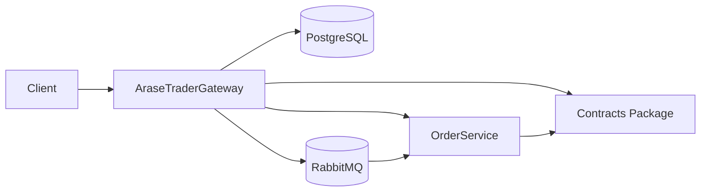
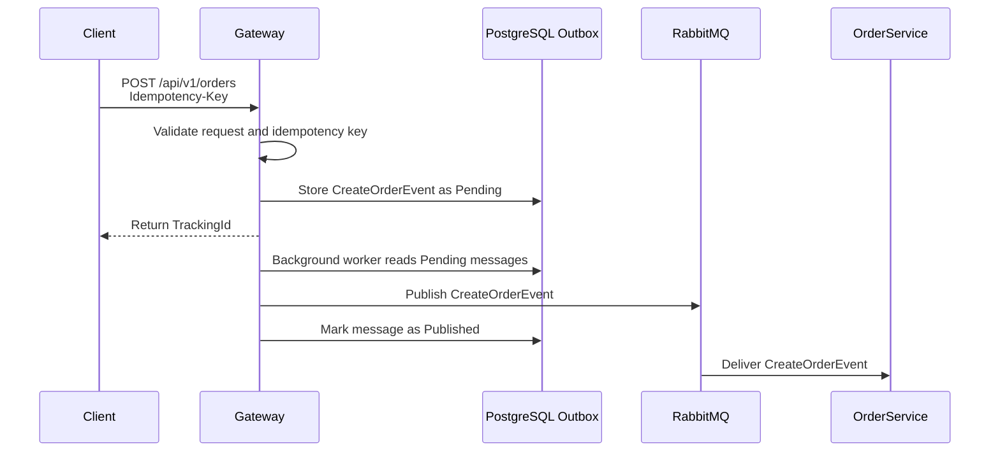
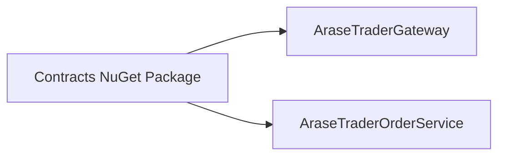

# AraseTraderGateway

## Overview

AraseTraderGateway is the API Gateway of the AraseTrader distributed system. It is the public entry point for client-facing workflows and coordinates communication with internal services without exposing service-specific infrastructure details to clients.

The Gateway is responsible for:

- Accepting client requests through versioned HTTP APIs
- Validating incoming requests before they reach application use cases
- Applying idempotency to retry-sensitive commands
- Creating integration events for asynchronous order processing
- Persisting Outbox messages in PostgreSQL
- Publishing pending events to RabbitMQ
- Querying OrderService through gRPC
- Querying wallet data through gRPC

## Architecture



The Gateway follows a layered Clean Architecture structure:

- `Api`: HTTP endpoints, versioned controllers, ViewModels, validation, and mappings
- `Application`: use case contracts and application-facing abstractions
- `Domain`: core domain models such as the Outbox message
- `Infrastructure`: persistence, RabbitMQ publishing, gRPC clients, and background processing

## Main Responsibilities

### Order Creation

Order creation is handled as an asynchronous workflow. The Gateway accepts the client request, validates it, assigns a tracking identifier, creates a `CreateOrderEvent`, and stores it as an Outbox message. The actual order processing is delegated to downstream services through RabbitMQ.

### Idempotency

The `AddOrder` endpoint requires an `Idempotency-Key` header. This prevents duplicate orders when clients retry requests or submit the same command multiple times. If the same key is received again, the Gateway returns the original tracking identifier instead of creating a new Outbox message.

### Outbox Pattern

The Gateway uses the Outbox Pattern to persist integration events before publishing them. This avoids losing events when RabbitMQ is temporarily unavailable and keeps request handling reliable across process restarts and transient infrastructure failures.

### RabbitMQ Publishing

Pending Outbox messages are published to RabbitMQ by a background service. Publishing infrastructure is isolated behind an application abstraction, keeping broker-specific concerns out of the Outbox processing logic.

### gRPC Communication

Read operations that require data from OrderService or wallet-related data use code-first gRPC through `protobuf-net.Grpc`. Controllers call Gateway services, and those services delegate to typed gRPC clients registered through dependency injection.

## Order Creation Flow



## Reliability and Consistency

### Idempotency-Key

The `Idempotency-Key` header represents the logical identity of a client command. It is stored with the Outbox message and protected by a unique filtered database index, ensuring only one logical order request is created for the same key.

### Outbox Pattern

Integration events are stored transactionally in PostgreSQL before being published. This improves consistency between accepted API commands and eventual message delivery.

### Reliable Message Delivery

The Outbox publisher reads pending messages in batches, publishes them to RabbitMQ, and records delivery state. Failed attempts increment retry counters, preserve error details, and eventually mark messages as failed after the retry limit.

### Retry-Safe Requests

Clients can safely retry `AddOrder` requests with the same `Idempotency-Key`. The Gateway returns the original tracking identifier and does not create duplicate integration events.

## RabbitMQ Integration

The Gateway publishes `CreateOrderEvent` messages to RabbitMQ for asynchronous order processing. RabbitMQ enables event-driven communication between the Gateway and OrderService, allowing the Gateway to accept requests quickly while downstream processing happens independently.

RabbitMQ-specific code is isolated in Infrastructure. The Outbox publisher depends on a message bus abstraction, which improves testability and keeps broker concerns separate from Outbox state management.

## gRPC Integration

The Gateway uses gRPC for internal query operations:

- Order queries by tracking identifier
- Wallet lookup by customer identifier
- Wallet transaction queries by wallet identifier

The implementation uses code-first gRPC with `protobuf-net.Grpc` and typed clients registered through dependency injection. This keeps inter-service communication strongly typed while avoiding REST calls for internal service queries.

## Shared Contracts Package

The distributed system shares integration contracts through a dedicated Contracts package. This package contains:

- gRPC service contracts
- Request and response models
- Integration event contracts

The Contracts project should be distributed as a private NuGet package. The Gateway consumes these contracts instead of referencing OrderService implementation details directly.



This approach provides:

- Contract-first integration
- Reduced coupling between services
- Independent deployments
- Versioned contracts for safer evolution

## Configuration

Runtime configuration is provided through `appsettings.json`, environment-specific appsettings files, environment variables, or container orchestration configuration.

Key configuration areas:

- `ConnectionStrings`: PostgreSQL connection string used by the Gateway persistence layer and Outbox storage
- `RabbitMq`: RabbitMQ host, port, virtual host, exchange, and routing key settings for integration event publishing
- `OrderService`: gRPC endpoint used for internal OrderService queries

Do not store real credentials in source control. Production secrets should be provided through a secret manager, CI/CD variables, Docker secrets, Kubernetes secrets, or another secure runtime configuration mechanism.

## Running Locally

To run the Gateway locally, prepare the required infrastructure first:

1. Start PostgreSQL and create or migrate the Gateway database.
2. Start RabbitMQ and ensure the configured virtual host and credentials are available.
3. Configure the OrderService gRPC address so wallet and order query endpoints can reach OrderService.
4. Run the API project from the solution root:

```bash
dotnet run --project Api/Api.csproj
```

The API exposes versioned endpoints under `/api/v1`.

## Docker

Build the Gateway image:

```bash
docker build -t arasetrader-gateway .
```

Run the container:

```bash
docker run --rm -p 8080:8080 arasetrader-gateway
```

When using Docker Compose, provide database, RabbitMQ, and OrderService settings through environment variables or compose configuration. Avoid placing production secrets in the image or repository.

## Design Decisions

### Why Outbox Pattern Was Used

The Gateway accepts commands that must eventually become integration events. The Outbox Pattern ensures the event is durably stored before publishing, reducing the risk of accepted requests being lost during broker outages or process failures.

### Why RabbitMQ Was Chosen

RabbitMQ provides reliable asynchronous messaging and enables event-driven communication between the Gateway and OrderService. This keeps order creation decoupled from immediate downstream processing.

### Why gRPC Was Chosen Instead of REST

Internal query communication uses gRPC because it provides strongly typed contracts, efficient HTTP/2 transport, and a better fit for service-to-service calls than public REST-style APIs.

### Why Idempotency-Key Is Required

Client retries and repeated submit actions can otherwise create duplicate orders. The `Idempotency-Key` gives the Gateway a stable request identity so repeated requests return the original tracking identifier.

### Why Gateway Does Not Write to the OrderService Database

The Gateway owns request intake and integration boundaries, not OrderService persistence. OrderService remains responsible for its own database, business rules, and order lifecycle. This preserves service autonomy and avoids cross-service database coupling.

## Related Repository

`AraseTraderOrderService` is the downstream service responsible for order-domain processing and internal operational workflows. Its responsibilities include:

- Order processing
- Wallet updates
- Customer synchronization
- Hangfire jobs
- Distributed locking
- gRPC services consumed by the Gateway

## Technologies

- .NET 8
- ASP.NET Core
- PostgreSQL
- RabbitMQ
- gRPC
- protobuf-net.Grpc
- Entity Framework Core
- Docker
- FluentValidation
- Mapster
